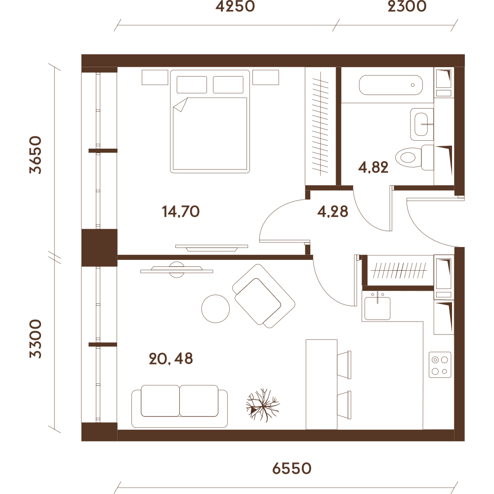
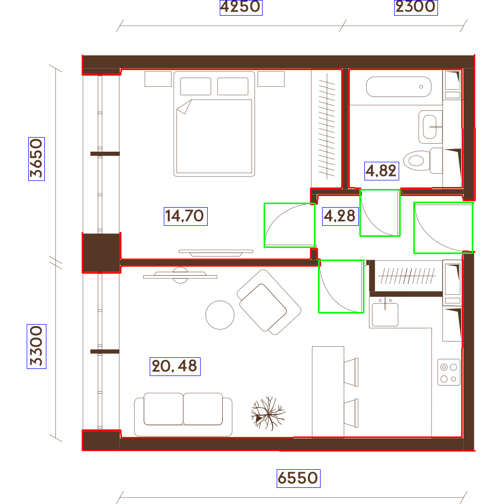

# Floor Plan Processing Project

**Проект предназначен для автоматического анализа архитектурных планов квартир.**  
Он извлекает основные элементы планов: стены, двери, размеры, и визуализирует их для удобного просмотра и дальнейшей обработки.
##### Папка input.zip содержит исходные изображения планов квартир, output.zip содержит визуализацию обработки изображений, а также JSON-файл с информацией об обнаруженных стенах, дверях и надписях на плане. Папка models.zip содержит веса предобученной модели для детектирования дверей на изображениях.

---

## Этапы проекта

1. **preprocessing.py**  
   - Конвертация изображений в grayscale  
   - Подавление шума, выравнивание контраста  
   - Адаптивная бинаризация для выделения стен

2. **walls.py**  
   - Морфологическая обработка для удаления мелких шумов и текстовых линий  
   - Выделение основных контуров стен    

3. **doors.py**  
   - Используется предобученная модель YOLO  
   - Применяются фильтры по размеру, соотношению сторон и confidence  

4. **ocr.py**  
   - Используется EasyOCR для распознавания текста на планах
   - В .json-файл текст и его размеры сохраняются с меткой `dimensions`    

5. **visualization.py**  
   - Визуализация полученных результатов обработки изображения: контуры стен, детекция дверей и размеров 
   - Результат сохраняется в отдельную папку `output/visualizations`  

6. **main.py (cохранение результата)**  
   - Все данные стен, дверей и размеров сериализуются в `result.json`

    

        
        
Исходное изображение

    

    

        
        
Обработанное изображение

    

---

## Стек / инструменты
 
- **OpenCV** — обработка изображений, морфология, контуры  
- **NumPy** — работа с массивами и геометрией  
- **EasyOCR** — утилита для извлечения размеров на планах  
- **Ultralytics YOLO** — детекция дверей  

**Обоснование выбора:**  
- OpenCV + NumPy использованы ввиду отсутствия мощностей для обучения архитектур на собственных данных; хороший инструмент для работы с геометрией без высоких технических требований   
- EasyOCR - готовое решение, не требующее сложной подготовки данных, в отличие от того же Tesseract  
- YOLO - предобученная модель на аннотированных дверях, не требует времени на разметку вручную  

---

## Слабые места

- **Предобработка изображения**: простая коррекция не всегда исправляет сильное искажение  
- **OCR**: ошибки распознавания на вертикальных надписях  
- **Детекция дверей**: модель  может пропускать двери с нестандартной формой или масштабом, т.к. обучена только на стандартных, "полукруглых" дверях  

---

## Что улучшить в следующей итерации

- Детекция/сегментация **комнат** - можно опробовать модель SAM для сегментации без аннотирования, либо же применить YOLO для детекции
- Улучшить распознавание стен с помощью YOLO, обученной на кастомных данных. Также подойдет UNet, но если сравнивать по скорости и точности, выбор идет в пользу YOLO  
- Добавить **коррекцию перспективы** с использованием углов плана для более точной бинаризации  
- Улучшить **OCR** - fine-tuning на собственных данных или же поиск более подходящей утилиты  
- Обучить **YOLO для детекции дверей, окон и мебели** для разных типов планов. Также можно опробовать self-supervised метод (например SimCLR или SimSiam) для того, чтобы не аннотировать изображения самостоятельно, однако это требует больших вычислительных мощностей  
- **Визуализация**: добавить интерактивный просмотр, чтобы можно было выделять интересующую область на плане (ROI - region of interest), чтобы рассматривать определенную область, если, например, план больших размеров
